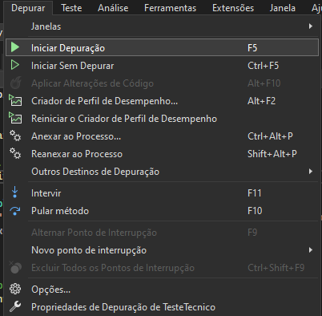

#  Teste Técnico S.H.

---

## 📌 Conteúdo

- [Sobre](#-about)
- [Tecnologias](#-technology)
- [Como usar](#-how-to-use)
- [Scripts](#-scripts)

## ✏️ Sobre

Esse projeto se trata de um desafio técnico para uma vaga de Desenvovedor de Software, onde o intuito do projeto é criar uma aplicação onde o usuário pode gerenciar as informações dos clientes cadastrados em sua loja.


## 💻 Tecnologias

- [.NET](https://dotnet.microsoft.com/pt-br/)
- [C#](https://learn.microsoft.com/pt-br/dotnet/csharp/)
- [MySQL](https://www.mysql.com/)
- [HTML5](https://developer.mozilla.org/en-US/docs/Web/HTML)
- [CSS3](https://developer.mozilla.org/pt-BR/docs/Web/CSS)
- [Bootstrap5](https://getbootstrap.com/)
- [Bootswatch](https://bootswatch.com/)
- [JQuery](https://jquery.com/)
- [jQuery Mask Plugin](https://igorescobar.github.io/jQuery-Mask-Plugin/)
- [DataTables](https://datatables.net/)

## 🛠️ Instalação:

1 - Abra o [Visual Studio](https://visualstudio.microsoft.com/pt-br/downloads/), clique na opção **Clonar um repositório**


2 - Na opção **Local do repositório** cole a URL do projeto a ser clonado, e na opção **Caminho** escolha um diretório vazio de sua preferência e clique no botão **Clonar** e aguarde.


3 - Abra o arquivo **Program.cs** e ajuste as configurações de conexão com o banco de dados e clique em **Salvar**. 
Obs: "Certifique-se de ter o MySql instalado em sua máquina"

 - server - servidor 
 - catalog - nome da base de dados a ser criada no banco
 - uid - usuário 
 - pwd - senha do usuário
 - ServerVersion - versão do MySQL
 


4 - Vá na opção **Ferramentas/Gerenciador de pacotes do NuGet/Console do Gerenciamento de Pacotes**


5 - No console digite o comando ```update-database``` e pressione a tecla **Enter**
Obs: "Comando para rodar as migrações"


6 - Agora, clique em **Iniciar Depuração** e sua aplicação estará pronta para ser utilizada.



---

Desenvolvido por [Emerson Gonçalves](https://www.linkedin.com/in/emerson-goncalves-dos-santos/). 